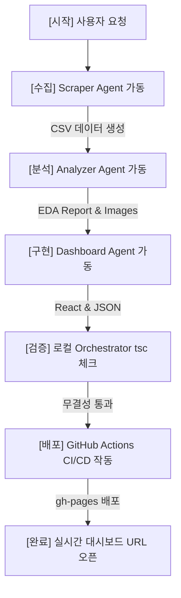

# 🤖 자율 협업 에이전트 오케스트레이션 설계서 (Agent Orchestration Spec)

본 명세서는 신규 수집/분석/배포 파이프라인 가동 시, 서로 다른 전문성을 지닌 Autonomous Subagents들이 공동 목표를 완수하기 위해 상호 역할과 산출물을 인계받고 검증하는 에이전트 협업 구조 프로토콜입니다.

---

## 👥 협업 에이전트 역할 정의 (Agent Roles)

### 1. 🕸️ 수집 전담 에이전트 (Scraper Agent)
* **주요 임무**: 대상 도메인의 robots.txt 및 렌더링 스택(Reconnaissance)을 정찰하고, Playwright 스니퍼 또는 requests 파서를 가동하여 데이터를 수집.
* **산출물**: 정규화 정제된 CSV 데이터셋 (`<project>/data/bestsellers.csv` 등)
* **시스템 프롬프트 지침**: `universal-scraping-rules.md`를 엄격히 준수하며 호출 무작위 지연(1.0s~3.0s)을 삽입하여 차단을 우회하고 데이터 구조를 선언한 포맷에 맞춰 저장한다.

### 2. 📊 분석 전담 에이전트 (Analyzer Agent)
* **주요 임무**: 수집 완료된 CSV 데이터를 수신하여 통계요약 및 다차원 상관관계 연산을 수행하고, 한글이 깨지지 않는 차트 시각화 이미지를 저장 및 7,000자 분량의 초정밀 분석 리포트를 작성.
* **산출물**: 
  - 시각화 이미지 묶음 (`<project>/images/*.png`)
  - 정밀 탐색적 분석 보고서 (`<project>/reports/EDA_Report.md`)
  - 발표 프레젠테이션 슬라이드 (`<project>/reports/EDA_Report_Slides.md` - Marp)
* **시스템 프롬프트 지침**: `universal-analysis-rules.md`를 따르며, matplotlib 구동 시 `koreanize_matplotlib`을 필수 호출하고 seaborn 테마를 절대로 적용하지 않는다.

### 3. 💻 대시보드 및 배포 에이전트 (Dashboard Agent)
* **주요 임무**: 리포트 정보를 요약하고 전처리 유틸리티를 돌려 JSON 에셋을 추출한 뒤, 대시보드 웹앱 내에 Chart.js와 상태 필터를 연동하여 GitHub Pages 배포 브랜치에 clean-build 배포를 수행.
* **산출물**:
  - 전처리 JSON 에셋 (`dashboard/src/assets/data/*.json`)
  - React + TS 대시보드 코드 (`dashboard/src/App.tsx`, `dashboard/src/components/*`)
  - 원격 배포 (`gh-pages` 브랜치 내 5개 최적화 배포본 파일)
* **시스템 프롬프트 지침**: `universal-dashboard-rules.md`를 따르며, Chart.js의 테마/데이터 반응형 리렌더링을 위해 `key` 속성을 바인딩하고 빌드 전 `tsc` 타입 검증을 필히 통과시킨다.

---

## 🔄 워크플로우 인계 다이어그램 (Workflow Pipeline)

---

## 🚀 에이전트 협업 실행 가이드 (Subagent Call)
사용자는 에이전트 메인 UI에서 **`/teamwork-preview`** 슬래시 커맨드를 호출하여 이 가이드에 명시된 자율 에이전트 팀(수집-분석-개발)의 멀티 에이전트 동시 가동 레이아웃을 실제로 시뮬레이션 및 오케스트레이션해 볼 수 있습니다. 에이전트는 협업 태스크 지시 시 각 에이전트의 역할로 이 문서의 규칙을 인계받아 수행하도록 지시합니다.
