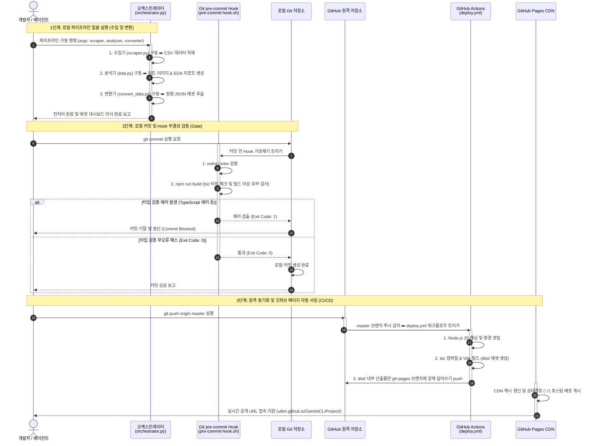

# 🎨 범용 데이터 자동화 파이프라인 아키텍처 다이어그램

본 문서는 수집, 분석, 리포팅, 대시보드 렌더링 및 훅 기반 검증으로 이어지는 범용 자동화 프레임워크의 상세 데이터 흐름 및 에이전트 협업 구조를 시각화한 Mermaid 다이어그램 문서입니다.

---

## 📊 파이프라인 통합 흐름도 (Mermaid Diagram)

---

## 🔄 파이프라인 시퀀스 다이어그램 (Sequence Diagram)

본 시퀀스 다이어그램은 수집-분석-커밋-빌드-배포 전 과정에 참여하는 로컬 구성원들과 원격 깃허브 파이프라인 간의 **시간 순서 흐름과 역할 인계 상호작용**을 구체적으로 도식화한 것입니다.

