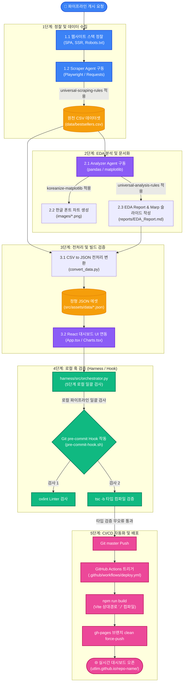

# 🎨 범용 데이터 자동화 파이프라인 아키텍처 다이어그램

본 문서는 수집, 분석, 리포팅, 대시보드 렌더링 및 훅 기반 검증으로 이어지는 범용 자동화 프레임워크의 상세 데이터 흐름 및 에이전트 협업 구조를 시각화한 Mermaid 다이어그램 문서입니다.

---

## 📊 파이프라인 통합 흐름도 (Mermaid Diagram)

```mermaid
flowchart TD
    %% 스타일 정의
    classDef init fill:#3b82f6,stroke:#1d4ed8,stroke-width:2px,color:#fff;
    classDef agent fill:#8b5cf6,stroke:#6d28d9,stroke-width:2px,color:#fff;
    classDef validate fill:#10b981,stroke:#047857,stroke-width:2px,color:#fff;
    classDef deploy fill:#ec4899,stroke:#be185d,stroke-width:2px,color:#fff;
    classDef data fill:#f59e0b,stroke:#d97706,stroke-width:1px,color:#fff;

    %% 노드 정의
    Start(["🚀 파이프라인 개시 요청"]):::init
    
    subgraph Step1 ["1단계: 정찰 및 데이터 수집"]
        Recon["1.1 웹사이트 스택 정찰<br>(SPA, SSR, Robots.txt)"]
        Scraper["1.2 Scraper Agent 구동<br>(Playwright / Requests)"]
        RawCSV[("원천 CSV 데이터셋<br>(data/bestsellers.csv)")]:::data
    end
    
    subgraph Step2 ["2단계: EDA 분석 및 문서화"]
        Analyzer["2.1 Analyzer Agent 구동<br>(pandas / matplotlib)"]
        Charts["2.2 한글 폰트 차트 생성<br>(images/*.png)"]
        Report["2.3 EDA Report & Marp 슬라이드 작성<br>(reports/EDA_Report.md)"]
    end
    
    subgraph Step3 ["3단계: 전처리 및 빌드 검증"]
        Preprocess["3.1 CSV to JSON 전처리 변환<br>(convert_data.py)"]
        JsonAsset[("정형 JSON 에셋<br>(src/assets/data/*.json)")]:::data
        Dashboard["3.2 React 대시보드 UI 연동<br>(App.tsx / Charts.tsx)"]
    end

    subgraph Step4 ["4단계: 로컬 훅 검증 (Harness / Hook)"]
        Hook{"Git pre-commit Hook 작동<br>(pre-commit-hook.sh)"}:::validate
        LintCheck["oxlint Linter 검사"]
        TscCheck["tsc -b 타입 컴파일 검증"]
        HarnessCli["harness/src/orchestrator.py<br>(5단계 로컬 일괄 검사)"]:::validate
    end

    subgraph Step5 ["5단계: CI/CD 자동화 및 배포"]
        Commit["Git master Push"]
        Actions["GitHub Actions 트리거<br>(.github/workflows/deploy.yml)"]
        BuildStep["npm run build <br>(Vite 상대경로 './' 컴파일)"]
        DeployStep["gh-pages 브랜치 clean force-push"]:::deploy
        LiveUrl(["🌐 실시간 대시보드 오픈<br>(utlim.github.io/repo-name/)"]):::deploy
    end

    %% 관계선 매핑
    Start --> Recon
    Recon --> Scraper
    Scraper -->|universal-scraping-rules 적용| RawCSV
    
    RawCSV --> Analyzer
    Analyzer -->|koreanize-matplotlib 적용| Charts
    Analyzer -->|universal-analysis-rules 적용| Report
    
    RawCSV & Report --> Preprocess
    Preprocess --> JsonAsset
    JsonAsset --> Dashboard
    
    Dashboard --> HarnessCli
    HarnessCli -->|로컬 파이프라인 일괄 검사| Hook
    Hook -->|검사 1| LintCheck
    Hook -->|검사 2| TscCheck
    
    TscCheck -->|타입 검증 무오류 통과| Commit
    Commit --> Actions
    Actions --> BuildStep
    BuildStep --> DeployStep
    DeployStep --> LiveUrl

    %% 스타일 바인딩
    class Start,Recon,Scraper init;
    class Analyzer,Dashboard agent;
    class LintCheck,TscCheck validate;
    class Commit,Actions,BuildStep deploy;
```
