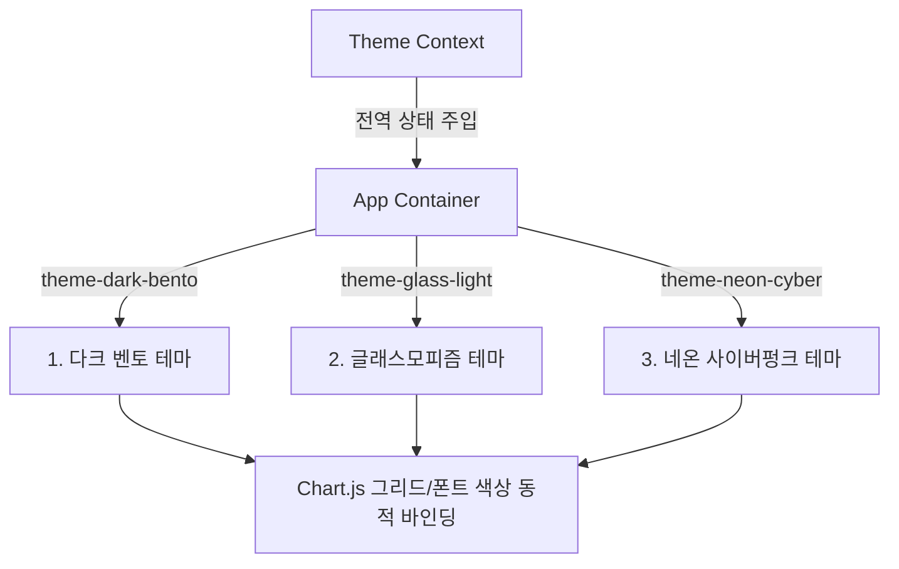

# YES24 vs 교보문고 컴퓨터/IT 베스트셀러 비교 분석 웹 대시보드 구축 계획서

본 설계 계획서는 YES24(1,000위)와 교보문고(100위)의 컴퓨터/IT 분야 베스트셀러 데이터 분석 결과 보고서([YES24 EDA 보고서](file:///Users/utaekim/aiProject/GeminiCLIPorject/yes24/reports/EDA_Report.md), [교보문고 EDA 보고서](file:///Users/utaekim/aiProject/GeminiCLIPorject/kyobobooks/reports/EDA_Report.md))를 상호 비교하고, 사용자에게 다양한 시각화 분석과 인터랙티브한 도서 탐색 기능을 제공하는 **초프리미엄 반응형 웹 대시보드** 구축을 위한 마스터플랜입니다.

---

## 1. 프로젝트 개요 및 아키텍처

### 1.1 구축 목적
- 두 대표 서점(YES24, 교보문고)의 베스트셀러 데이터를 크로스 플랫폼 관점에서 시각적으로 분석 및 비교.
- AI 트렌드(클로드, 제미나이 등)와 수험서(컴활, 정보처리기사 등) 등 핵심 도서 도메인의 시장 성과를 직관적으로 전달.
- 단순 스태틱 이미지 위주의 보고서를 뛰어넘어, 사용자가 가격 범위, 출판사, 키워드 등을 직접 필터링하고 특정 도서의 순위/가격을 1:1로 매핑하여 볼 수 있는 인터랙티브 비즈니스 인텔리전스(BI) 도구 제공.

### 1.2 기술 스택 (Technology Stack)
- **프레임워크**: React (Vite 기반, 컴포넌트 단위의 빠른 SPA 대시보드 구축)
- **언어**: TypeScript (데이터 모델 스키마 정의 및 타입 안전성 확보)
- **스타일링**: Tailwind CSS (유연하고 세련된 반응형 디자인 시스템 신속 구현)
- **시각화 라이브러리**: Chart.js (with `react-chartjs-2` 래퍼)
- **데이터 처리**: Python (`pandas` 기반의 CSV to JSON 정적 빌드 사전 처리)

---

## 2. 테마 선택 기능 및 디자인 시스템 (UI/UX)

사용자의 요구사항에 맞추어, 첫 눈에 독자를 매료시킬 수 있는 3종의 전역 UI 테마 시스템을 구축하고 헤더의 테마 스위처를 통해 실시간 토글 가능하게 설계합니다.



### 2.1 3대 테마 콘셉트 정의
1. **Sleek Dark Bento Theme (다크 벤토 테마)**
   - **배경**: 심해와 같은 깊고 정제된 다크 그레이/블랙 계열 (`#0B0F19`, `#161F30`)
   - **카드**: 부드러운 섀도우와 미세한 보더가 적용된 입체적인 사각형 벤토 그리드 레이아웃.
   - **차트**: 네이비 및 스카이블루 라인, 다크 테마용 연회색 그리드 라인 적용.
2. **Glassmorphism Theme (글래스모피즘 테마)**
   - **배경**: 부드러운 파스텔톤 오로라 그라디언트 백그라운드.
   - **카드**: 반투명 글래스(`backdrop-blur-md bg-white/30 border-white/40`) 효과 및 고광택 반사 라인.
   - **차트**: 반투명 채우기 색상과 정갈한 파스텔 파이 차트 구성.
3. **Neon Cyberpunk Theme (네온 사이버 테마)**
   - **배경**: 완전한 칠흑색 어둠 (`#050508`)
   - **카드**: 강렬한 형광색 네온 핑크, 네온 시안의 그라디언트 테두리 및 글로우 효과 (`box-shadow: 0 0 15px rgba(255, 0, 128, 0.4)`).
   - **차트**: 발광성 네온 라인 및 레이더 차트의 극대화된 형광 광선 표현.

---

## 3. 대시보드 화면 설계 및 5대 핵심 차트 (Chart.js)

웹 대시보드는 상단의 전역 필터 바와 함께 벤토 그리드 구조로 유연하게 정렬되며, 다음 5가지 Chart.js 시각화 콤보가 배치됩니다.

### 3.1 5대 핵심 차트 정의
1. **서점별 가격대 분포 차트 (Multi-series Bar / Line Chart)**
   - **X축**: 가격 구간 (1만원 이하, 1~2만원, 2~3만원, 3~4만원, 4만원 초과)
   - **Y축**: 도서 수 (빈도수)
   - **특징**: YES24와 교보문고의 가격 범위를 나란히 오버랩하여 IT 도서 가격 고착화 현상을 시각화.
2. **주요 출판사별 점유율 및 성과 차트 (Horizontal Bar & Radar Chart)**
   - **구조**: 출판사별 베스트셀러 등재 도서 수와 평균 평점을 가로 막대 및 방사형 차트로 다차원 비교.
   - **특징**: 3대 메이저(길벗, 한빛미디어, 영진닷컴)의 과점 상태를 즉각 시각적 체감 유도.
3. **서점별 평점(Rating)대 분포 비교 차트 (Doughnut / Polar Area Chart)**
   - **구조**: 10.0 만점, 9.5-9.9점, 9.0-9.4점, 9.0점 미만의 비율 시각화.
   - **특징**: 평점 인플레이션의 좌측 쏠림 현상을 다이내믹한 극좌표 차트로 명확하게 드러냄.
4. **순위 구간별 리뷰 수 및 판매지수 성과 차트 (Combo Line-Bar Chart)**
   - **막대(Bar)**: 평균 리뷰 수 (Y1축)
   - **꺾은선(Line)**: 평균 판매지수 (Y2축)
   - **X축**: 순위 구간 (1-20위, 21-40위, 41-60위, 61-80위, 81-100위)
   - **특징**: 순위 상승에 따른 리뷰 볼륨의 쏠림(임계점)을 복합 차트로 표시.
5. **TF-IDF 기반 핵심 키워드 가중치 비교 차트 (Grouped Bar Chart)**
   - **X축**: TF-IDF 가중치 점수
   - **Y축**: 주요 핵심 키워드 (ai, 시나공, 클로드, 제미나이, 컴활 등 15개 핵심어)
   - **특징**: 두 서점의 데이터 마이닝 결과를 정량 비교하여 최근 IT 트렌드의 주소지 증명.

---

## 4. 6대 인터랙티브 기능 및 도서 비교 매핑

정밀한 클라이언트 사이드 탐색 기능을 위해 다음과 같은 필터/매핑 엔진을 프론트엔드 내부에 구현합니다.

### 4.1 핵심 기능 사양
1. **실시간 통합 검색 및 정렬 엔진**
   - 도서 제목, 저자, 출판사를 통합 필터링하며 순위순, 가격순, 리뷰 수순, 평점순으로 지연(Lag) 없이 고속 런타임 정렬 지원.
2. **1:1 도서 매칭 비교 뷰 (Cross-platform Mapping)**
   - **알고리즘**: 도서 제목의 불필요한 공백/특수문자/개행 및 개정년도 표시를 전처리 정규화하여 두 서점 간 동일 도서를 실시간 매칭(Exact / Fuzzy Match).
   - **UI**: 매칭된 도서 클릭 시, 좌/우 슬라이딩 카드로 **"YES24 순위: 3위 vs 교보문고 순위: 15위"**, **"가격차이: 1,800원"**, **"평점 및 리뷰비교"**를 한눈에 극적으로 노출.
3. **양방향 가격 범위 레인지 슬라이더 (Double-ended Range Slider)**
   - 정가 또는 판매가를 슬라이딩 핸들러 두 개로 조절하여 자신이 예산 범위 내(예: 15,000원 ~ 28,000원)에 들어오는 서적들만 대시보드 전체에 실시간 반영되도록 동적 결합.
4. **출판사 및 할인율 멀티 셀렉트 필터**
   - 체크박스 드롭다운을 통해 특정 관심 출판사들(예: 한빛미디어, 이지스퍼블리싱)의 도서들만 멀티 필터링하여 대시보드에 투영.
5. **핵심 키워드 태그 클릭 디스패처**
   - 대시보드 상단에 배치된 트렌디 키워드 뱃지(예: `#AI`, `#클로드`, `#시나공`, `#컴활`)를 마우스 클릭 시, 해당 태그 키워드가 제목/부제에 들어간 도서들만 실시간으로 즉시 전면 필터링.
6. **동적 통계 요약표 매핑**
   - 사용자가 필터링 조건을 바꿀 때마다, 하단의 데이터 요약 통계 테이블(Crosstab 형태)의 수치(평균가, 리뷰 수 총합 등)가 실시간으로 재계산되어 통계적 신뢰성 자동 반영.

---

## 5. 데이터 파이프라인 및 빌드 자동화

대시보드 웹앱이 DB 연결 없이 초고속으로 독립 구동할 수 있도록 데이터 변환 및 빌드 파이프라인을 사전에 자동화합니다.

```text
[bestsellers.csv (YES24/교보)]
             │
             ▼ (convert_data.py 실행)
[assets/data.json (정적 JSON 변환)]
             │
             ▼ (Vite 빌드 시 Bundle 포함)
[React SPA Client-side Memory Load]
```

### 5.1 데이터 변환 스크립트 작성 계획
- **파일 경로**: `kyobobooks/src/convert_data.py`
- **기능**:
  - `yes24/data/bestsellers.csv`와 `kyobobooks/data/bestsellers.csv`를 읽어들임.
  - 가격 텍스트(예: "1,500원" -> 1500) 및 날짜 텍스트의 정밀 파싱 및 통일화 전처리 수행.
  - `src/assets/data/` 디렉터리에 `yes24.json`과 `kyobo.json`으로 저장.

---

## 6. 단계별 구현 마일스톤

| 단계 | 주요 태스크 | 상세 작업 내용 |
| :--- | :--- | :--- |
| **1단계** | **데이터 전처리 자동화** | Python 스크립트로 두 서점의 CSV 데이터를 공통 JSON 포맷으로 사전 파싱 및 변환 완료. |
| **2단계** | **프로젝트 빌드 및 테마 구축** | Vite React 프로젝트 생성, Tailwind CSS 설정 및 Theme Context(다크, 글래스, 네온) 뼈대 구축. |
| **3단계** | **Chart.js 컴포넌트 구현** | 3대 테마 색상과 반응형 크기를 지원하는 Chart.js 5종 시각화 래퍼 컴포넌트 완성. |
| **4단계** | **실시간 필터 및 1:1 비교 설계** | 양방향 슬라이더, 태그 필터링 및 동일 도서명 자동 1:1 비교 매핑 알고리즘 구현. |
| **5단계** | **폴리싱 및 최종 사용자 검증** | 마이크로 애니메이션(Framer Motion 등 활용) 추가, 차트 반응형 레이아웃 정교화 및 릴리즈. |
