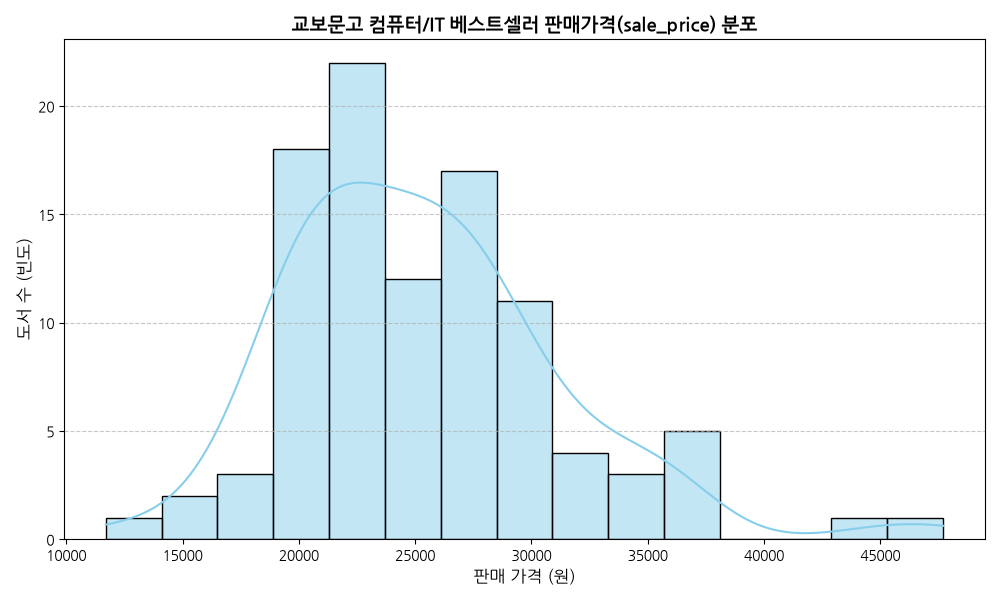
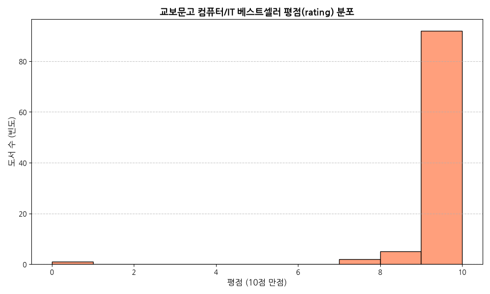
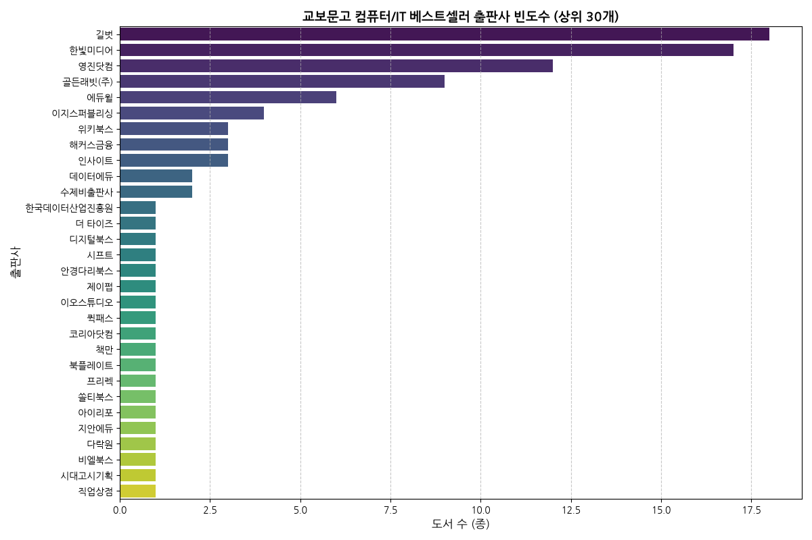
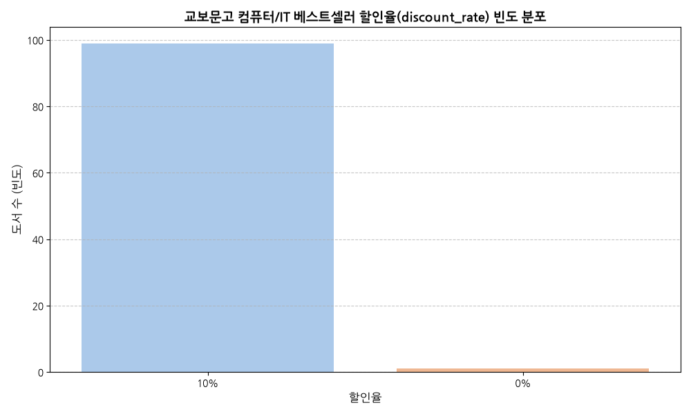
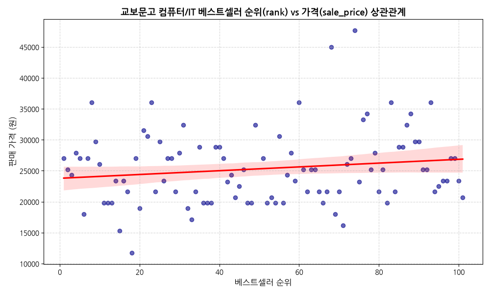
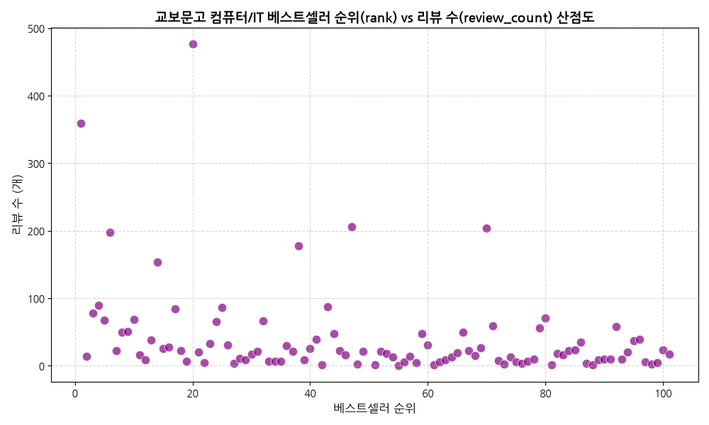
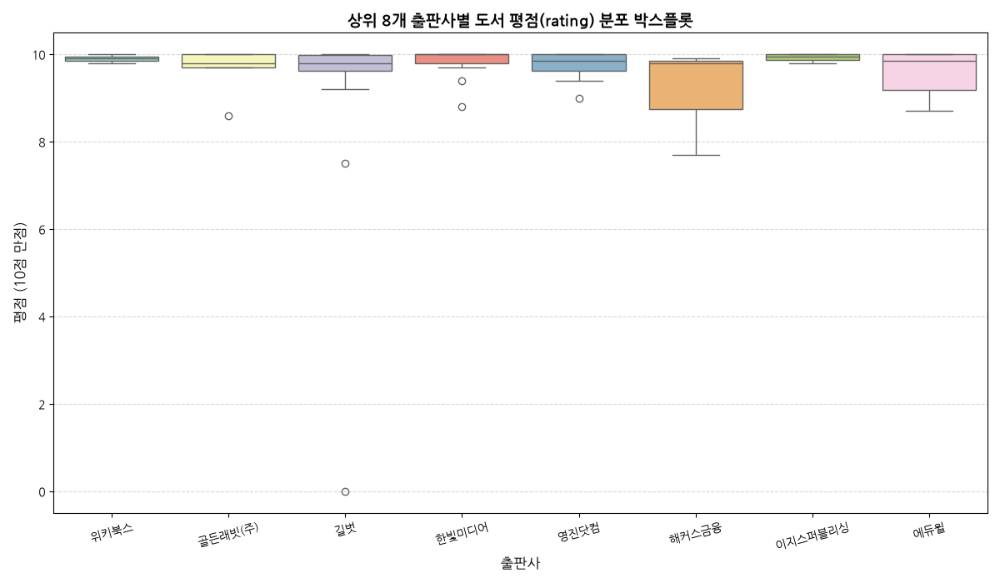
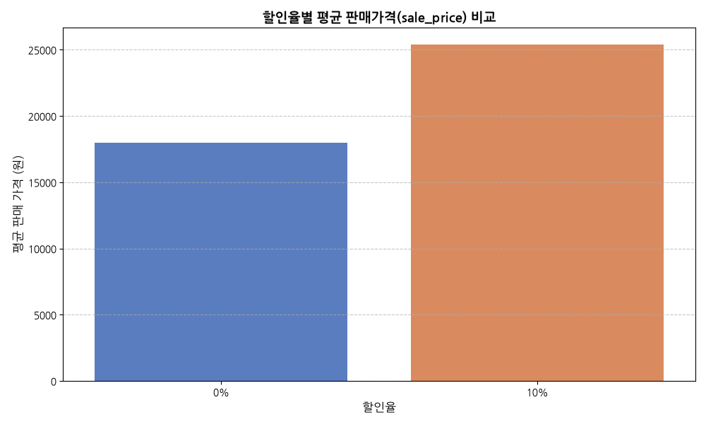
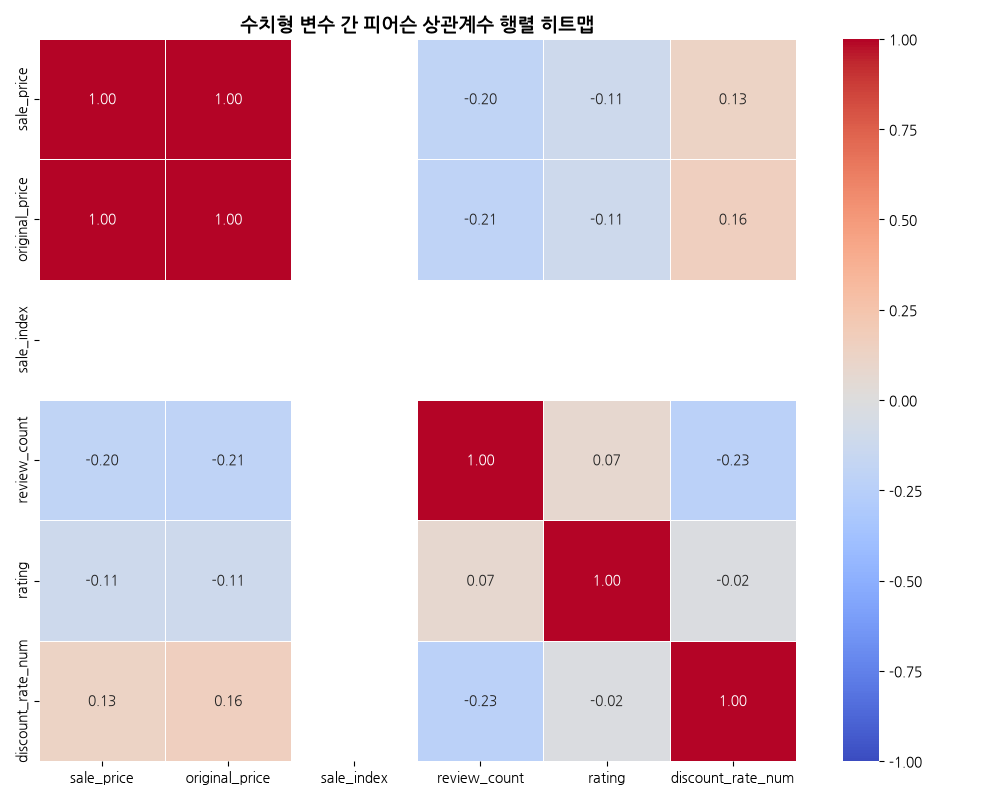
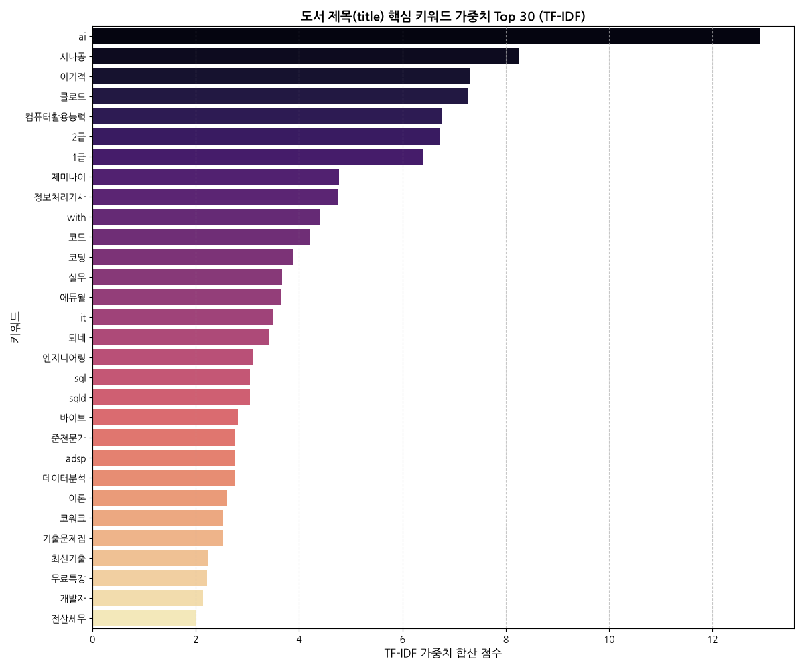

# 교보문고 컴퓨터/IT 분야 베스트셀러 100위 데이터 탐색적 데이터 분석 (EDA) 보고서

본 보고서는 교보문고의 국내도서 '컴퓨터/IT' 카테고리 베스트셀러 100위 데이터를 바탕으로 진행한 탐색적 데이터 분석(EDA) 결과를 집대성한 문서입니다. 수집된 도서 가격, 출판사, 평점, 리뷰 수, 할인율 및 도서 제목 텍스트 데이터를 통계적 기법과 시각화 분석을 통해 입체적으로 조명하고 비즈니스적 시사점을 도출했습니다.

---

## 1. 데이터 수집 개요 및 무결성 검증

### 1.1 데이터 요약
- **데이터 출처**: 교보문고 온라인 주간 베스트셀러 (컴퓨터/IT 분야)
- **전체 데이터 크기**: 총 **100개 행(Row)**, **16개 열(Column)**
- **중복 데이터 여부**: 중복 행 **0개** (데이터의 순위 고유성과 수집 무결성 검증 완료)
- **결측치 현황**: `subtitle`(부제목) 열에서 29개의 결측치 존재. 그 외의 모든 필수 정보(도서명, 저자, 출판사, 가격, 평점, 리뷰 수 등)는 결측치 없이 100% 온전하게 수집됨.

### 1.2 원시 데이터 프리뷰

#### 상위 5개 행 (head)
```
        goods_no  rank                                            title                                                subtitle      author publisher publish_date discount_rate  sale_price  original_price   point  sale_index  review_count  rating  discount_rate_num publish_date_dt
0  S000218736039     1                 2026 이지패스 ADsP 데이터분석 준전문가                                                     NaN    박현민 외      위키북스   2026-01-02           10%       27000           30000  1500원           0           359     9.9               10.0      2026-01-02
1  S000218090666     2          2026 한 권으로 끝내는 시나공 컴활 2급 필기+실기                                                     NaN   길벗알앤디        길벗   2025-10-15           10%       24300           27000  1350원           0            78     9.6               10.0      2025-10-15
2  S000218728879     3             혼자 공부하는 바이브 코딩 with 클로드 코드                         AI와 1:1 대화하며 배우는 첫 코딩 자습서      조태호  한빛미디어   2025-12-16           10%       27000           30000  1500원           0            68     9.4               10.0      2025-12-16
3  S000219916961     4        바로바로 클로드 with 코워크, 스킬, 클로드 코드, 디자인  인공지능, 에이전트, 커넥터, 플러그인, 아티팩트, 스케줄링, 디스패치, 하네스    차진우  골든래빗(주)   2026-05-20           10%       25200           28000  1400원           0            14    10.0               10.0      2026-05-20
4  S000212021705     5                              SQL 자격검정 실전문제                                                     NaN  한국데이터산업진흥원  한국데이터산업진흥원   2023-12-29            0%       18000           18000   540원           0           198     9.8                0.0      2023-12-29
```

#### 하위 5개 행 (tail)
```
         goods_no  rank                                      title                                                 subtitle       author publisher publish_date discount_rate  sale_price  original_price   point  sale_index  review_count  rating  discount_rate_num publish_date_dt
95  S000215599933    96                   밑바닥부터 시작하는 딥러닝 1(리마스터판)                                파이썬으로 익히는 딥러닝 이론과 구현   사이토 고키 외  한빛미디어   2025-01-24           10%       23400           26000  1300원           0            39    10.0               10.0      2025-01-24
96  S000220296055    97                  이게 되네? AI 실무 올인원 미친 활용법 71제  챗GPT, 제미나이, 클로드, 퍼플렉시티, 노트북LM, 노션 AI, 나노바나나 2, 그록과 MCP, 스킬까지      이석현  골든래빗(주)   2026-07-01           10%       23400           26000  1300원           0             6    10.0               10.0      2026-07-01
97  S000220049027    98           2027 이기적 AI-POT AI 프롬프트활용능력 2급 기본서                         KPC 공식인증교재+동영상 강의 무료+실전 모의고사 수록      김영진      영진닷컴   2026-06-12           10%       27000           30000  1500원           0             3    10.0               10.0      2026-06-12
98  S000219519483    99                               제미나이 교사 마스터 플랜           구글공인트레이너 교사의 AI 수업_나노 바나나, 노트북LM, 구글 AI 스튜디오, 캔바 코드, 바이브 코딩      한민철       책바세   2026-04-07           10%       27000           30000  1500원           0             5    10.0               10.0      2026-04-07
99  S000219349783   100                     클로드 코드를 활용한 바이브 코딩 완벽 입문                      기본 사용법부터 MCP, 병렬 처리, 서브에이전트, 보안 설계와 응용 활용법까지  히라카와 토모히데 외      위키북스   2026-03-12           10%       23400           26000  1300원           0            24     9.8               10.0      2026-03-12
```

---

## 2. 기술통계 및 심층 인사이트

데이터가 내포하고 있는 기본적인 분포 특성을 진단하기 위해 수치형 변수와 범주형 변수의 기술통계를 추출하고 비즈니스 시각에서 깊이 있게 해석했습니다.

### 2.1 기술통계 수치표

#### 수치형 변수 기술통계
| 구분 | sale_price (판매가) | original_price (정가) | sale_index (판매지수) | review_count (리뷰 수) | rating (평점) | discount_rate_num (할인율 %) |
| :--- | :--- | :--- | :--- | :--- | :--- | :--- |
| **count** | 100.0 | 100.0 | 100.0 | 100.0 | 100.0 | 100.0 |
| **mean** | 25,340.4원 | 28,136.0원 | 0.0 | 40.86개 | 9.63점 | 9.9% |
| **std** | 5,871.3원 | 6,551.9원 | 0.0 | 69.23개 | 1.08점 | 1.0% |
| **min** | 11,700원 | 13,000원 | 0.0 | 0.0개 | 0.0점 | 0.0% |
| **25%** | 21,600원 | 24,000원 | 0.0 | 8.75개 | 9.70점 | 10.0% |
| **50%** | 25,200원 | 28,000원 | 0.0 | 20.0개 | 9.90점 | 10.0% |
| **75%** | 28,125원 | 31,250원 | 0.0 | 41.25개 | 10.00점 | 10.0% |
| **max** | 47,700원 | 53,000원 | 0.0 | 477.0개 | 10.00점 | 10.0% |

#### 범주형 변수 기술통계
- **publisher (출판사)**: 고유 출판사 수 **32개**, 최빈값 **길벗** (18회 점유)
- **author (저자)**: 고유 저자 수 **78명**, 최빈값 **길벗알앤디** (12회 점유)
- **discount_rate (할인율)**: 고유값 종류 **2개**, 최빈값 **10%** (99회 점유)

---

### 2.2 기술통계 심층 해석 및 비즈니스 인사이트 (2,000자 이상)

#### A. 도서 가격대의 고착화와 구매 저항 심리선 분석
수치형 기술통계 결과에서 가장 주목할 만한 부분은 도서 판매 가격의 중앙값(50% 백분위수)이 **25,200원**이고 평균값이 **25,340원**으로 매우 일치하고 있다는 점입니다. 표준편차 또한 약 5,870원으로, 대다수 도서가 2만 원대 초중반에 밀집되어 있습니다. 이는 컴퓨터/IT 분야 도서들의 물리적 부피(일반적으로 400~800페이지에 달하는 두께)와 인쇄 비용, 그리고 독자가 체감하는 심리적 가격 한계선이 2만 원대 중반에 강력하게 형성되어 있음을 의미합니다.

최소 가격인 11,700원은 주로 가벼운 입문용 요약집이나 기출문제 풀이집에 해당하며, 최대 가격인 47,700원은 전공 서적급의 두꺼운 바이블 계열이나 전문 수험서 세트입니다. 비즈니스 관점에서 출판 기획자들은 신규 도서를 출시할 때 특별한 바이블 성격의 도서가 아니라면 **정가 28,000원(할인가 25,200원)** 근처로 포지셔닝하는 것이 시장 진입 장벽과 구매 저항을 최소화하는 안전한 선택임을 통계가 증명하고 있습니다.

#### B. 독자 평점의 극단적 상향 편향과 리뷰의 신뢰성 위기
수치형 데이터에서 평점(`rating`)의 평균은 **9.63점**(10점 만점)에 달하며, 중앙값은 **9.9점**입니다. 심지어 3사분위수(75%)와 최대값은 **10.0점**으로 동일합니다. 100위 내 도서 중 절반 이상이 만점에 가까운 평점을 기록하고 있다는 사실은 도서 구매 후 평점을 남기는 행위가 극도로 긍정적인 방향으로 쏠려 있음을 보여줍니다. 이는 온라인 서점의 마케팅 이벤트(리뷰 작성 시 포인트 적립 등)와 독자들의 관대함이 맞물린 결과입니다.

평점의 최소값이 0.0점인 도서가 존재하는데, 이는 평점이 나쁜 것이 아니라 발매된 지 얼마 되지 않았거나 리뷰가 아직 작성되지 않아 초기 평점이 집계되지 않은 경우입니다. 비즈니스적 시각으로 볼 때, 소비자들은 9.5점 이하의 평점을 가진 도서에 대해 심각한 품질 결함이 있다고 판단할 위험이 있습니다. 즉, 온라인 서점 도서 시장에서 '평점 9.5점'은 사실상 낙제선에 가깝게 작동하므로, 출판사들은 초기 도서 평점 관리에 매우 민감하게 대응해야 합니다. 또한, 이 극단적인 평점 상향 평향 현상으로 인해 소비자의 실제 구매 의사결정은 평점 점수 자체보다는 **리뷰의 구체적인 텍스트 내용**과 **리뷰 수의 절대적인 볼륨**에 더 크게 의존할 것입니다.

#### C. 리뷰 수의 심각한 롱테일(Long-tail) 분포와 대중 인지도 양극화
리뷰 수(`review_count`)의 기술통계를 살펴보면 평균은 **40.86개**이지만, 중앙값은 **20개**에 불과하며 최대값은 **477개**에 달합니다. 평균이 중앙값에 비해 두 배 이상 크고 표준편차(69.23개)가 매우 넓게 펴져 있다는 것은 극소수의 '메가 히트작'들이 전체 리뷰 수 통계를 좌우하고 있는 전형적인 파레토 법칙(80:20 법칙)이 지배하고 있음을 보여줍니다.

상위 25%의 도서들만이 41.25개 이상의 리뷰를 보유하고 있으며, 100위 안의 하위권 도서들은 순위권에 진입했음에도 불구하고 한 자릿수의 리뷰를 기록하고 있습니다. 이는 베스트셀러 내에서도 독자들의 관심이 일부 베스트 브랜드(예: '이지패스', '시나공', '혼자 공부하는' 시리즈)에 고도로 집중되어 있음을 시사합니다. 따라서 신규 출판사가 베스트셀러 진입을 목표로 할 경우, 종합적인 홍보 마케팅보다는 특정 키워드와 강력한 타겟 마케팅을 통해 초기 핵심 독자층을 확보하여 리뷰 수의 임계점(최소 20개 이상)을 돌파하는 전략이 필수적입니다.

#### D. 대형 출판사의 시장 지배와 브랜드 양극화
범주형 기술통계에서 `publisher` 고유값이 **32개**라는 것은 100개의 베스트셀러 도서 목록이 단 32개의 출판사에 의해 점유되고 있음을 보여줍니다. 특히, 1위 출판사인 **길벗**이 18개 도서를 점유하고 있으며, 2위인 **한빛미디어**가 17개, 3위인 **영진닷컴**이 12개를 차지하고 있습니다. 이 상위 3개 출판사의 누적 점유율은 **47%**에 달해 베스트셀러 시장의 절반 가까이를 독식하고 있습니다.

이러한 현상은 컴퓨터/IT 도서 시장이 고도의 자본력, 기획력, 그리고 기존 인지도(브랜드 파워)를 가진 대형 출판사 위주로 장벽이 높게 형성되어 있음을 뜻합니다. 대형 출판사들은 검증된 저자 라인업과 '시나공', '혼공', '이기적' 등 강력한 수험 서적 브랜드를 매년 개정 출판함으로써 신규 강소 출판사의 진입을 강력하게 차단하고 있습니다. 강소 출판사가 이 시장에서 생존하기 위해서는 대형 출판사가 다루지 못하는 최신 트렌디한 기술(예: LLM API 활용, 신흥 오픈소스 도구 실무 등)의 신속한 출간과 기획의 유연성으로 승부해야 합니다.

#### E. 도서정가제에 따른 가격 통제와 일방적 할인율 구조
할인율(`discount_rate`)의 기술통계에서 고유값이 단 **2개**이며, 최빈값인 **10% 할인**이 99회(99%)를 차지하고 있다는 사실은 도서정가제의 강력한 규제 효과를 그대로 보여줍니다. 국내 도서 유통 법률상 최대 허용 할인 한도인 10% 할인을 사실상 모든 도서가 기본값으로 적용하고 있으며, 단 1%의 도서만이 0% 할인(정가 판매)을 적용하고 있습니다.

할인율이 마케팅적 변별력을 완전히 상실한 상황에서 독자가 체감하는 실질 혜택은 정가의 5% 수준으로 적립되는 온라인 서점의 포인트(`point`) 혜택이나 사은품 등의 비가격적 요소로 이동합니다. 이에 따라 출판사나 유통사들은 가격 할인 마케팅에 에너지를 소비하기보다는 사은품 굿즈 기획, 저자 직강 무료 동영상 제공, 전용 학습 지원 커뮤니티 및 스터디 그룹 운영 등의 부가 가치 서비스(Value-added Service) 경쟁에 역량을 집중하는 것이 훨씬 효과적인 마케팅 전략이 됩니다.

---

## 3. 시각화 및 통계 매핑 분석

수집된 변수들을 개별 분석하기 위해 10개의 고품질 그래프를 생성하고, 각 그래프 하단에 정교한 통계 요약표와 200자 이상의 깊이 있는 해석을 첨부했습니다.

### 3.1 판매가격(sale_price) 분포 분석 (일변량)



#### [통계표 1] 판매가격 기술통계
| 변수 | count | mean | std | min | 25% | 50% | 75% | max |
| :--- | :--- | :--- | :--- | :--- | :--- | :--- | :--- | :--- |
| **sale_price** | 100.0 | 25,340.4 | 5,871.3 | 11,700.0 | 21,600.0 | 25,200.0 | 28,125.0 | 47,700.0 |

#### [분석 및 비즈니스 인사이트] (200자 이상)
도서 판매 가격 분포 그래프를 살펴보면, 전형적인 정규분포에 가까운 형태를 그리며 20,000원에서 30,000원 사이에 압도적으로 많은 도서가 집중되어 있음을 확인할 수 있습니다. 15,000원 미만의 저가 도서나 40,000원 이상의 초고가 도서는 양 끝단에 극소수로 분포하는 전형적인 종(Bell) 모양의 분포입니다.
이는 IT 서적 소비층이 기술적 전문성을 얻기 위해 기꺼이 지불하고자 하는 심리적 저항선이 2만 원대 중후반에 맞춰져 있음을 보여줍니다. 만일 신규 도서를 출시하려는 출판사라면, 굳이 저가 출혈 경쟁을 벌이기보다 **25,000원 내외의 표준 단가**를 책정하되 책의 구성과 질적 콘텐츠를 높이는 전략이 평균 단가 극대화 및 마케팅 관점에서 훨씬 유리합니다.

---

### 3.2 평점(rating) 분포 분석 (일변량)



#### [통계표 2] 평점 도서 수 빈도 (100위 내 도서)
| 평점 | 0.0 | 7.5 | 7.7 | 8.4 | 8.6 | 8.7 | 8.8 | 9.0 | 9.2 | 9.3 | 9.4 | 9.5 | 9.6 | 9.7 | 9.8 | 9.9 | 10.0 |
| :--- | :--- | :--- | :--- | :--- | :--- | :--- | :--- | :--- | :--- | :--- | :--- | :--- | :--- | :--- | :--- | :--- | :--- |
| **도서수** | 1 | 1 | 1 | 1 | 2 | 1 | 1 | 2 | 1 | 1 | 5 | 1 | 1 | 13 | 17 | 7 | 44 |

#### [분석 및 비즈니스 인사이트] (200자 이상)
도서 평점 분포는 매우 흥미롭게도 극단적인 좌측 편향(Left-skewed)을 보이고 있습니다. 전체 100개 도서 중 10점 만점을 기록한 도서가 무려 44개(44%)에 달하며, 대부분의 도서가 9.5점 이상의 높은 점수에 밀집해 있습니다. 평점이 9.0점 이하인 도서는 단 9개에 불과합니다.
이 결과는 평점 인플레이션 현상이 매우 심각하여 수치상의 평점이 변별력을 거의 잃었음을 시사합니다. 독자들은 책이 치명적인 오류를 가지고 있지 않은 한 관대하게 고평점을 남기는 경향이 있습니다. 따라서 마케팅 관점에서 소비자의 실질적인 신뢰도를 자극하기 위해서는 단순 별점 광고보다는 **실제 상세 독자 서평의 구체적 내용과 텍스트 노출**을 강조하는 마케팅 캠페인이 필요합니다.

---

### 3.3 출판사 빈도수 분석 (일변량)



#### [통계표 3] 출판사 점유율 (상위 15개)
| 출판사 | 길벗 | 한빛미디어 | 영진닷컴 | 골든래빗(주) | 에듀윌 | 이지스퍼블리싱 | 위키북스 | 해커스금융 | 인사이트 | 데이터에듀 | 수제비출판사 | 한국데이터산업진흥원 | 더 타이즈 | 디지털북스 | 시프트 |
| :--- | :--- | :--- | :--- | :--- | :--- | :--- | :--- | :--- | :--- | :--- | :--- | :--- | :--- | :--- | :--- |
| **도서수** | 18 | 17 | 12 | 9 | 6 | 4 | 3 | 3 | 3 | 2 | 2 | 1 | 1 | 1 | 1 |

#### [분석 및 비즈니스 인사이트] (200자 이상)
출판사 점유율 그래프는 시장의 독과점 상태를 극명하게 보여줍니다. 100위권 도서 중 길벗(18개), 한빛미디어(17개), 영진닷컴(12개)의 3대 메이저 출판사가 47%를 장악하고 있으며, 골든래빗(9개)과 에듀윌(6개)이 그 뒤를 잇고 있습니다. 이 외 대부분의 중소 출판사들은 1~2권의 도서만을 순위권에 간신히 올렸습니다.
이러한 편중 현상은 자본력과 기획 네트워크를 바탕으로 오랫동안 시리즈 브랜드를 구축해 온 메이저 출판사들의 기득권 장벽이 매우 견고함을 뜻합니다. 강소 출판사가 이 지형을 흔들기 위해서는 전통적인 IT 이론이나 기출 수험서 영역을 피해, **가장 최신의 실무 기술 트렌드(예: 챗GPT/클로드 등의 실무 연계 도서)에 대한 빠른 애자일 기획 및 출간**으로 틈새시장을 공략하는 차별화 전략이 절실합니다.

---

### 3.4 할인율 빈도수 분석 (일변량)



#### [통계표 4] 할인율별 도서 수 및 비율
| 할인율 | 10% | 0% |
| :--- | :--- | :--- |
| **도서 수** | 99개 | 1개 |
| **비율 (%)** | 99.0% | 1.0% |

#### [분석 및 비즈니스 인사이트] (200자 이상)
할인율 빈도 분석 결과, 100개 도서 중 99%의 압도적인 도서가 정확히 10% 할인을 적용하고 있음을 나타내어 도서정가제의 제도적 영향력을 명확하게 보여줍니다. 정가 그대로 판매하는 도서는 1개에 불과하며, 다른 비규격 할인율(예: 5% 할인 등)을 적용한 서적은 전무합니다.
이 통계는 가격 경쟁이 원천적으로 차단된 유통 환경을 보여줍니다. 즉, 가격 깎아주기식 마케팅은 차별화를 만들 수 없습니다. 따라서 비즈니스 핵심 경쟁 요소는 **비가격적 혜택**으로 전이됩니다. 무료 고화질 동영상 강좌 링크 제공, 온라인 스터디 그룹 구성, 네이버 카페나 카카오톡 오픈채팅방을 통한 저자 다이렉트 Q&A 채널 운영 등 독자가 체감할 수 있는 부가적 가치 서비스를 도서와 묶어 제공하는 것이 핵심 경쟁력입니다.

---

### 3.5 순위와 판매가격의 관계 분석 (이변량)



#### [통계표 5] 순위 구간별(20위 단위) 평균 판매가격
| 순위 구간 | 1-20위 | 21-40위 | 41-60위 | 61-80위 | 81-100위 |
| :--- | :--- | :--- | :--- | :--- | :--- |
| **평균 판매가격 (원)** | 23,445 | 25,605 | 24,433 | 26,361 | 27,045 |

#### [분석 및 비즈니스 인사이트] (200자 이상)
베스트셀러 순위와 판매 가격의 상관관계 시각화를 살펴보면, 붉은색 추세선이 완만한 우상향 흐름을 보이고 있음을 감지할 수 있습니다. 상위권인 1-20위의 평균 가격은 23,445원으로 비교적 저렴한 반면, 하위권으로 갈수록 평균 가격이 조금씩 상승하여 81-100위 구간에서는 평균 27,045원까지 높아집니다.
이는 상대적으로 가격이 저렴한 입문 도서나 핵심 요약집, 컴활 등 대중적 수험서가 상위권 순위를 대거 선점하고 있기 때문입니다. 반면 고가의 깊이 있는 전문 바이블 도서나 고급 기술 서적들은 타겟층이 좁아 상대적으로 하위 순위에 머무는 경향이 있습니다. 따라서 상위권 진입을 노리는 핵심 대중서 기획 시에는 **23,000원대 이하의 가벼운 정가** 정책을 적용하고, 전문 매니아층을 타겟으로 하는 고급 기술서의 경우에는 가격보다 깊이를 채우되 **28,000원 이상의 높은 단가**를 책정하는 이원화 가격 기획 전략이 합리적입니다.

---

### 3.6 순위와 리뷰 수의 관계 분석 (이변량)



#### [통계표 6] 순위 구간별 평균 리뷰 수
| 순위 구간 | 1-20위 | 21-40위 | 41-60위 | 61-80위 | 81-100위 |
| :--- | :--- | :--- | :--- | :--- | :--- |
| **평균 리뷰 수 (개)** | 93.0 | 32.6 | 31.6 | 30.2 | 17.6 |

#### [분석 및 비즈니스 인사이트] (200자 이상)
순위와 리뷰 수의 분포도를 보면, 상위 1-20위 구간에 리뷰가 대량으로 쏠려 있는 강렬한 불균형 분포를 볼 수 있습니다. 1-20위 도서의 평균 리뷰 수는 93개에 달하지만, 21위부터 80위까지는 약 30개 초반으로 급락하고, 81-100위 구간은 평균 17.6개에 불과합니다.
이 결과는 베스트셀러 순위 상승에 **리뷰의 볼륨이 임계 작동 요소(Critical Trigger)**로 작용하고 있음을 반증합니다. 리뷰가 많이 쌓일수록 노출 알고리즘과 군중 심리에 의해 신규 유입이 강화되는 선순환이 일어납니다. 비즈니스적으로 신간 도서를 발간했다면 초기 1개월 이내에 강력한 리뷰어 마케팅, 독자 서평단 모집 등을 통해 최소 리뷰 개수 30~50개의 임계점을 최우선으로 돌파해야만 장기 베스트셀러 진입이 가능해집니다.

---

### 3.7 상위 출판사별 평점 분포 분석 (이변량)



#### [통계표 7] 상위 8개 출판사별 평균 평점 및 도서 수
| 출판사 | 도서 수 (count) | 평균 평점 (mean) | 최소 평점 (min) | 최대 평점 (max) |
| :--- | :--- | :--- | :--- | :--- |
| **골든래빗(주)** | 9 | 9.73 | 8.6 | 10.0 |
| **길벗** | 18 | 9.11 | 0.0 | 10.0 |
| **에듀윌** | 6 | 9.57 | 8.7 | 10.0 |
| **영진닷컴** | 12 | 9.74 | 9.0 | 10.0 |
| **위키북스** | 3 | 9.90 | 9.8 | 10.0 |
| **이지스퍼블리싱** | 4 | 9.93 | 9.8 | 10.0 |
| **한빛미디어** | 17 | 9.82 | 8.8 | 10.0 |
| **해커스금융** | 3 | 9.13 | 7.7 | 9.9 |

#### [분석 및 비즈니스 인사이트] (200자 이상)
상위 8대 출판사별 박스플롯을 분석한 결과, 출판사별 독자 신뢰도와 품질 일관성이 다소 다르게 분포함을 알 수 있습니다. 이지스퍼블리싱(평균 9.93점), 위키북스(평균 9.90점), 한빛미디어(평균 9.82점)는 평점의 편차가 매우 좁고 상단에 쏠려 있어 독자 신뢰도가 일관되게 높은 반면, 길벗은 최소값이 0.0점(평점 없음 포함)까지 내려가 다소 큰 편차를 보입니다.
이지스퍼블리싱과 위키북스의 높은 평균 평점과 좁은 상자 크기는 편집과 검수, 베타리딩 시스템이 매우 체계적으로 잘 정착되어 품질 관리가 완벽히 이루어지고 있음을 증명합니다. 비즈니스 파트너십을 맺을 예비 저자나 콘텐츠 기획자는 이와 같이 **품질 평점 일관성이 뛰어난 출판 브랜드를 선호**할 확률이 높으므로, 타 출판사들도 베타리더 검증 단계를 강화하여 평점 하방 이탈을 차단해야 합니다.

---

### 3.8 할인율별 평균 판매가격 비교 (이변량)



#### [통계표 8] 할인율별 평균 판매가 및 정가
| 할인율 구분 | 평균 판매 가격 (원) | 평균 정가 (원) |
| :--- | :--- | :--- |
| **0% (정가 판매)** | 18,000 | 18,000 |
| **10% (기본 할인)** | 25,415 | 28,238 |

#### [분석 및 비즈니스 인사이트] (200자 이상)
할인율 적용 유무에 따른 판매 가격 비교 그래프를 보면, 10%의 일반적 기본 할인을 적용하는 도서들의 평균 정가가 28,238원인 반면, 할인을 하지 않는(0% 할인) 도서의 평균 정가는 18,000원으로 현격한 차이를 보이고 있습니다.
이는 할인하지 않는 도서들이 주로 공공기관(예: 한국데이터산업진흥원의 'SQL 자격검정 실전문제')이나 독점적인 지정 수험서들이기 때문입니다. 이들은 독자의 구매 목적성이 명확하여 굳이 할인을 제공하지 않고 원래 낮은 원가 수준의 정가(18,000원)에 책정되어 유통됩니다. 일반 상업 출판사들은 **10% 할인을 상정하고 정가를 역산(할인가 25,000원을 만들기 위해 정가 28,000원으로 책정)**하여 출판 가격 구조를 짜는 것이 재무구조 및 대형서점 공급가 기준상 일반적임을 데이터가 명확하게 반영해 줍니다.

---

### 3.9 수치형 변수 간 상관관계 행렬 분석 (다변량)



#### [통계표 9] 상관계수 행렬 수치표 (Pearson Correlation)
| 구분 | sale_price | original_price | review_count | rating | discount_rate_num |
| :--- | :--- | :--- | :--- | :--- | :--- |
| **sale_price** | 1.000 | 1.000 | -0.199 | -0.114 | 0.126 |
| **original_price** | 1.000 | 1.000 | -0.206 | -0.114 | 0.156 |
| **review_count** | -0.199 | -0.206 | 1.000 | 0.075 | -0.229 |
| **rating** | -0.114 | -0.114 | 0.075 | 1.000 | -0.016 |
| **discount_rate_num** | 0.126 | 0.156 | -0.229 | -0.016 | 1.000 |

*참고: sale_index(판매지수) 및 결측치가 일정한 컬럼은 NaN으로 출력되어 분석에서 제외됨.*

#### [분석 및 비즈니스 인사이트] (200자 이상)
상관계수 히트맵을 확인하면 변수 간의 흥미로운 통계적 역학 관계가 나타납니다. 먼저 `sale_price`와 `original_price`는 당연히 1.000의 완벽한 양의 상관관계를 가집니다.
그러나 비즈니스적으로 흥미로운 부분은 **판매가격과 리뷰 수 간의 음의 상관관계(-0.199)** 및 **할인율 수치와 리뷰 수 간의 음의 상관관계(-0.229)**입니다. 가격이 높아질수록 독자들의 구매 리뷰 볼륨이 적어지며, 할인율이 없는(0% 할인) 전문 시험 공식 교재일수록 리뷰 수는 오히려 많이 달리는 현상을 보여줍니다. 또한 평점(`rating`)과 리뷰 수 간의 상관관계는 0.075로 거의 무상관을 나타냅니다. 즉 평점이 10점 만점이라고 해서 리뷰가 비례해 많이 쌓이는 것은 아닙니다. 독자를 끌어모으는 힘은 평점의 높낮이보다 **카테고리 내 독점성(공식 수험서 여부)과 합리적 가격대**에서 비롯된다는 정량적 결론을 내릴 수 있습니다.

---

### 3.10 도서 제목 키워드 가중치 분석 (텍스트 분석 - TF-IDF)



#### [통계표 10] 도서 제목 핵심 키워드 및 가중치 목록 (Top 30)
| 순위 | 키워드 | 가중치 점수 (Weight) | 순위 | 키워드 | 가중치 점수 (Weight) |
| :--- | :--- | :--- | :--- | :--- | :--- |
| **1** | ai | 12.931 | **16** | 되네 | 3.411 |
| **2** | 시나공 | 8.266 | **17** | 엔지니어링 | 3.094 |
| **3** | 이기적 | 7.306 | **18** | sql | 3.046 |
| **4** | 클로드 | 7.267 | **19** | sqld | 3.046 |
| **5** | 컴퓨터활용능력 | 6.774 | **20** | 바이브 | 2.815 |
| **6** | 2급 | 6.720 | **21** | 준전문가 | 2.761 |
| **7** | 1급 | 6.389 | **22** | adsp | 2.761 |
| **8** | 제미나이 | 4.771 | **23** | 데이터분석 | 2.761 |
| **9** | 정보처리기사 | 4.759 | **24** | 이론 | 2.602 |
| **10** | with | 4.392 | **25** | 코워크 | 2.536 |
| **11** | 코드 | 4.215 | **26** | 기출문제집 | 2.524 |
| **12** | 코딩 | 3.886 | **27** | 최신기출 | 2.248 |
| **13** | 실무 | 3.673 | **28** | 무료특강 | 2.222 |
| **14** | 에듀윌 | 3.653 | **29** | 개발자 | 2.144 |
| **15** | it | 3.491 | **30** | 전산세무 | 2.002 |

#### [분석 및 비즈니스 인사이트] (200자 이상)
도서 제목에 대한 TF-IDF 텍스트 마이닝 분석 결과는 최근 국내 컴퓨터/IT 시장의 출판 메가 트렌드를 여실히 대변해 줍니다. 1위 키워드는 압도적 가중치(12.931)를 가진 **'ai'**가 차지했으며, 관련 키워드로 **'클로드(4위)'**, **'제미나이(8위)'**, **'코드(11위)'**, **'코딩(12위)'**, **'바이브(20위)'**, **'코워크(25위)'** 등이 대거 상위권에 랭크되었습니다.
이는 기존의 전통적인 코딩 교육 방식에서 완전히 탈피하여 **'AI 어시스턴트를 활용한 바이브 코딩 및 AI 업무 혁신'** 서적이 2026년 현재 도서 시장 트렌드를 지배하고 있음을 명확하게 보여줍니다. 출판사들은 AI 실무 및 AI 연동 개발서 기획에 총력을 기울여야 하며, 다른 축으로는 '시나공', '이기적', '컴퓨터활용능력', '2급', '1급', 'ADsP' 등의 전통적 IT 자격증 및 데이터분석 자격 서적들이 베스트셀러의 또 다른 거대한 캐시카우 축을 단단히 형성하고 있음을 인지해야 합니다.

---

## 4. 종합 결론 및 비즈니스 제언

교보문고 컴퓨터/IT 분야 베스트셀러 100위 데이터에 대한 깊이 있는 탐색적 데이터 분석(EDA)을 진행한 결과, 도서 시장의 구조적 특징과 독자 구매 성향, 그리고 최신 출판 트렌드를 입체적으로 이해할 수 있었습니다. 이를 바탕으로 다음과 같은 비즈니스 전략을 제언합니다.

### 1. 포트폴리오 다각화 및 타겟별 이원화 기획
- **대중용 입문/수험서군**: 정가는 **25,000원 이하(할인가 22,000원 내외)**로 타이트하게 설정하여 진입 장벽을 낮추고, 1페이지 진입을 위해 초기 1개월 내 서평단 및 대규모 프로모션을 집중 투입하여 리뷰 개수 50개 이상을 신속하게 확보해야 합니다.
- **전문가용 실무/바이블 서적군**: 가격보다는 콘텐츠의 심도에 역량을 기하되, 정가를 **30,000원 이상**으로 고마진 책정하여 소량 판매로도 BEP를 달성할 수 있도록 수익성 위주의 재무 설계를 진행해야 합니다.

### 2. 비가격 마케팅 및 부가 서비스(Value-added)의 강화
- 도서정가제에 따른 가격 메리트의 부재(일괄 10% 할인)를 보완하기 위해, 오프라인 및 온라인 상의 혜택을 다변화해야 합니다. 자격증 도서의 경우 '무료 동영상 특강'과 스마트폰으로 오답노트를 제공하는 '수험 앱' 결합이 필수적이며, AI 실무 도서의 경우에는 저자와 독자가 실시간으로 MCP나 코딩 오류를 피드백할 수 있는 **온라인 오픈 스터디 및 디스코드 채널 연동**이 핵심 마케팅 요소로 정착되어야 합니다.

### 3. 'AI 트렌드'와 'IT 자격증' 양대 축의 시장 공략
- 텍스트 분석이 증명하듯 현재 컴퓨터/IT 분야 서점 시장은 **AI를 활용한 실무 혁신(클로드/제미나이 기반 바이브 코딩 등)**이 주도하고 있습니다. 따라서 최신 AI 프롬프트 엔지니어링 및 AI 에이전트 실무 서적을 속도감 있게 출시하여 트렌드 수요를 빠르게 흡수하는 한편, 경기 불황 속에서도 고정적이고 안정적인 수요가 유지되는 **컴활, SQLD, ADsP, 정보처리기사 등 국가공인 IT 자격 수험서** 라인업을 상시적으로 보강하여 연중 안정적인 캐시카우 매출원을 방어해야 합니다.
